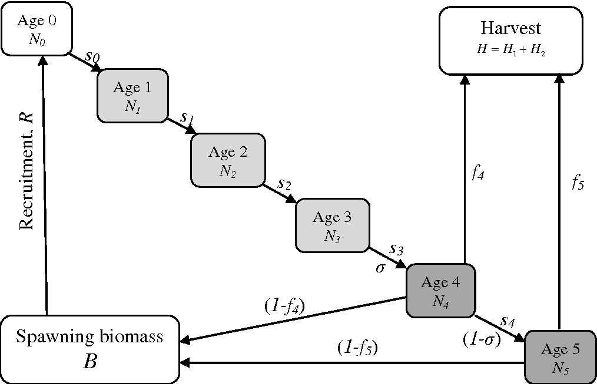
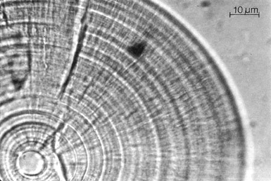

# Motivation

- Fisheries models require information about the age structure of fish populations



---

# Motivation

- To get this info, take a sample of the population

- Count growth layers on a tiny ear bone called an otolith

.pull-left[

]

.pull-right[

]

--

- But this process is time-consuming and therefore expensive

---

# Motivation

- It is easier and cheaper to measure fish lengths


- But fish lengths do not correspond perfectly to fish ages

---

# Your Assignment

- Treat the 1000 observations of fish lengths as a Gaussian mixture 

- Estimate the proportion that belong to each of 3 age cohorts

- Estimate the expected mean and sd of length-at-age

```{r, echo=FALSE, fig.width=7, fig.height=4}

load("FishLengths.RData")

hist(x$Length, prob=TRUE, 
     xlim=c(0, 100),
     xlab="Fish Length (cm)",
     main=NA)
lines(density(x$Length), col="blue", lwd=2)

```

---

# Your Assignment

- You will use the expectation maximization algorithm to perform estimation (details are provided in the assignment brief)

--

- Assignment tasks are clearly outlined in the brief
  - Some are specific, some are open-ended
  - Please follow the instructions!

---

# Your Assignment

- You will be working in randomly assigned teams of 4 and collaborating via Git and GitHub

--

- The practical on Friday will help you get comfortable with Git
  - Please come and sit with your team during the practical 
  - We will walk through setting up your repositories together

--

- Resources are posted on the course GitHub/Moodle
  - If you have time, take a look before Friday

---

# Your Assignment

- Due on October 19th at 11:59AM

- Mark comprises 20% of your final grade

- All team members will receive the same mark 

- Criteria:
 - 10 marks for automated tests
 - 10 marks for code design and testing
 - 10 marks for programming style
 - 10 marks for documentation
 - 10 marks for additional enhancements