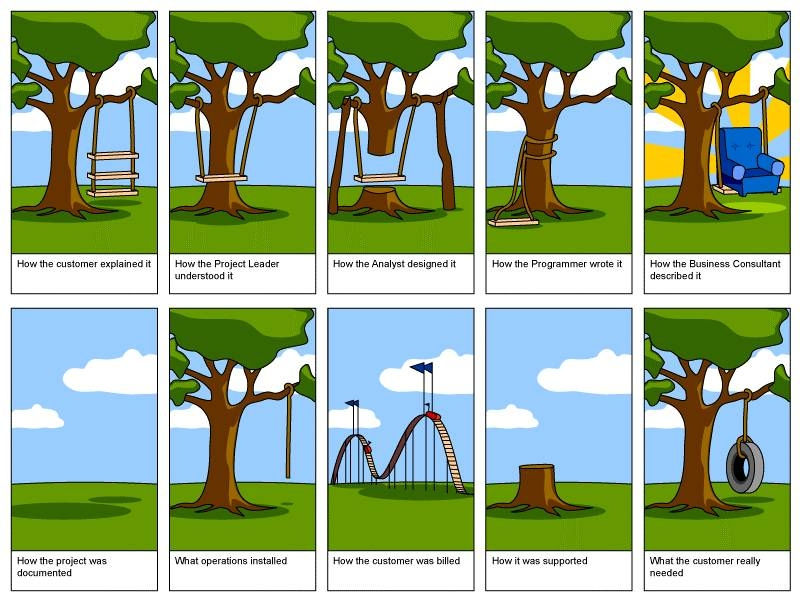
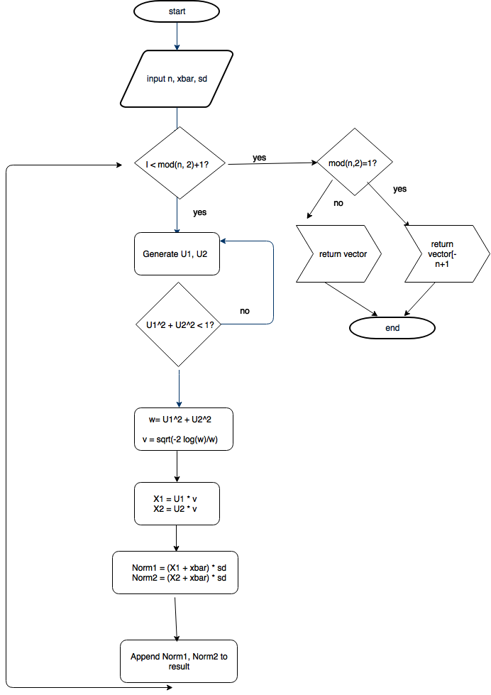

Lecture 3: MT4113
========================================================
author: Eric Rexstad
date: 27 Sept 2017
width: 1920
height: 1000

<style>
.small-code pre code {
  font-size: 1.5em;
}
.tiny-code pre code {
  font-size: 1em;
}
.reveal section del {
  color: red;
}
</style>

Announcements
============
type: alert
incremental: false

- Assignment 1 due **1200** Monday 02Oct via MMS
   - single file upload as a plain text file (can be `source()` in R)
- Assignment 1 will be peer-reviewed
  - you will receive access to submissions of two anonymous colleagues
  - you will provide *useful* comments embedded in their code
  - upload to MMS, I will see comments are returned to author of the code
- Office hour/drop-in session
  - Wednesday afternoons 1300 

Comparative advantages of creating functions
=====================================

- construction
    - function does only one thing
- testing
    - function does only one thing
- debugging
    - function does only one thing
- maintenance
    - less duplication, modifications easy to make
- expansion/enhancement
    - improving a function makes improvement available to all code using the function
- re-use
    - general functions can built into warehouse of tools
- _disadvantage_
    - more planning required before coding
    - slight execution time cost
    
Concepts of functional programming
==============================

- __encapsulation__
    - send everything needed for computation into function as arguments
    - return outputs explicitly with `return()` function
    - do not make changes to objects outside the function (__principle of least privilege__)
        - very rarely might it be useful violate this principle
        - these are types of exceptions that need documentation in code

Example:  principle of least privilege
======================================
incremental: false
Variables within a function at time of definition 
- populated with _different_ values at time of execution


```r
print.and.multiply <- function(x, y) {
   print(paste('Starting function x=', x, 'y=', y))
   x <- x*y
   print(paste('Before leaving function x=', x))
   return(x)
}
first <- 10
second <- 20
new.object <- print.and.multiply(first, second)
```

```
[1] "Starting function x= 10 y= 20"
[1] "Before leaving function x= 200"
```

```r
first
```

```
[1] 10
```

Environments
==============
class: tiny-code
Structures that organise objects in an R programme

- associates a set of names to a set of values
    


  
perhaps pointing to same object address


Environments also have parents

***

For our purposes, we care most about:

- __global environment__
    - this is where your programme does most of its work
- __current environment__
    - comes into existence when inside functions
- when packages are loaded
    - parents of the global environment are added
- viewed using `search()` or the `Environment` tab of R-Studio


```
 [1] ".GlobalEnv"        "package:knitr"     "package:stats"    
 [4] "package:graphics"  "package:grDevices" "package:utils"    
 [7] "package:datasets"  "package:methods"   "Autoloads"        
[10] "package:base"     
```

See Wickham (2015) [Section 8](http://adv-r.had.co.nz/Environments.html)

Scoping
=======
incremental: false
Rules governing how R discovers the value of a symbol (see Wickham 2015 [scoping](http://adv-r.had.co.nz/Functions.html#lexical-scoping))

- (such as `my.value <- 24`)

- Rule 1: _Name masking_
    - if a name isn't defined in an environment, R looks up one level in the environment structure
    
> Horrible code you would never write (but you might inherit)

```r
x <- 1
h <- function() {
  y <- 2
  i <- function() {
    z <- 3
    return(c(x, y, z))
  }
  return(i())
}
print(h())
```

```
[1] 1 2 3
```

***
- An example of functions defined inside other functions
- Calling function `h()` causes `h` to be executed, but also causes `i` to be defined
- After `i` is defined, it is then called via `i()`
- Unpleasantly, neither of the functions `h()` or `i()` have defined arguments
    - yet values of `x`, `y`, and `z` are determined and printed to the console 
- Where are these values determined?


Scoping Rule 2
=======
incremental: false

_Equivalence of search for functions and variables_

Finding functions works the same as finding variables


```r
n <- function(x) x/2
o <- function() {
  n <- 10
  result <- n(n)
  return(result)
}
o()
```

```
[1] 5
```

> It is poor form to give variables and functions the same name; you would never do that


Scoping Rule 3
=======
incremental: false

_Fresh start_
- each use of a function is independent of any previous uses
- a function's environment is wiped clean for each new use


```r
j <- function() {
  if(!exists("a")) {
    a <- 1
  } else {
    a <- a + 1
  }
  print(a)
}
j()
```

```
[1] 1
```

```r
j()
```

```
[1] 1
```

Scoping Rule 4
=======
incremental: false

Scoping rules define where to look for values associated with objects

- lookup happens at time code is executed (_dynamic lookup_), not when code (or function) is created


```r
f <- function() x+1
x <- 15
f()
```

```
[1] 16
```

```r
x <- 20
f()
```

```
[1] 21
```

> This is not clever programming, violating the principle of encapsulation

If you have written a lengthy function 
    - and cannot recognise whether it violates the principle of encapsulation
    - this function is diagnostic

```r
codetools::findGlobals(f)
```

```
[1] "+" "x"
```

Purpose of learning about scoping and environments
===============
incremental: false
- Proficient programming
    - a good woodworker knows their tools
- understanding scoping can help you diagnose strange behaviour of your code


```r
multiply <- function (x,y) {
   result <- x1*y
   return(result)
 }
x1 <- 10
#
#  more code happened here
#
a <- 7
b <- 20
(multiply.results <- multiply(a,b))
```

```
[1] 200
```


Testing and debugging
======================
incremental: false
- Why test code?
    - Nobody writes perfect code
    - Testing can demonstrate sections of code work properly
        - reduces _possible suspects_ for further debugging
- _Test driven development_ (see later)
    - Tests can be used to structure writing of code
- With luxury of a software team
    - Have different people perform testing than those who wrote code
    
***

- Debugging methods
    - Compile (interpreter) time
        - Only errors found here are syntax problems or
            - for some languages, whether variables have been initialised for use
    - Batch debugging
        - Peppering code with `print()` statements
        - Run code, examine output to find unexpected (erroneous) results
        - Clumsy approach (code needs to be sanitized of `print()` after errors found)
    - Interactive debugging
        - Set breakpoints
        - Step through code
        - Examine and alter variables while code pauses

The life of software
==========================

Given you are developing software for others to use,

Statistical software, like other goods, have a lifetime with stages

- specification (what should it do)
- definition (how it should be done)
- implementation (writing code)
- verification (checking it meets the specification)
- delivery and usage
- maintenance (keeping it operational)

***

- Software development is **big business**
- Stands to reason there are systematic approaches to the undertaking
- Software engineers devote their profession to the pursuit
- On this campus, you could take an entire module to the subject
    - CS3051 Software engineering
        - Somerville, I. 2011. Software engineering, 9th Edition. Pearson education


Two contrasting approaches
===========================

- Plan-driven software development
- Agile software development
- Plan-driven (_waterfall_ model)
    - specification/definition/implementation done in unwavering order
    - Agreement between user and programmers from the beginning
    - Documentation and verification of each stage of the process
    - Advantage
        - End result is agreed at project beginning
        - Lots of documentation
        - Works well for large projects and large organisations
    - Disadvantages
        - Inflexible, struggles when project requirements change
    - Example
        - "We need software to automate statistical analyses we have previously performed ad-hoc."

***
- Agile development (_iterative_ model)
    - Planning of project is incremental
    - Do a bit of specification, bit of coding, bit of verification -- where do we stand
    - Start simple, modify design, enhance capabilities, repeat
    - Advantage
        - Can respond to changing circumstances
        - Less time agreeing and documenting decisions (more efficient)
    - Disadvantages
        - End-result of code is undefined until the end
        - Less documentation of decisions (less robust than plan-driven)
    - Example
        - "Let's develop a new algorithm and software for predicting consumer spending patterns."

Cartoon
=========



Software design for statisticians
=======================

- Commonly a blend of plan-driven and iterative methods
    - The larger the project (complexity or personnel) the more advantages of plan-driven
    - Time spent in design and documentation are seldom wasted
    
- Make use of pseudo-code or flowcharts
    - Transition stage between algorithm and code
    - Focus is upon flow of control and approach, rather than syntax
    - Break task into sub-tasks
        - Make modules out of sub-tasks
        - Name modules (verbs) and define inputs/outputs
    - Skeleton of code can now be built with module (function) input/output
        - Each module can have the rudiments of documentation constructed
        
***         
  
        
- Finally write the actual code


Adapting (recycling) existing code
=================

- Don't reinvent the wheel
- __R__ being open-source, has lots of code that can be adapted
- If you use code written by someone else
    - Acknowledge them in your use of code (and subsequent reports)
    - Test that it actually performs for your purposes
    - Take time to understand code and learn from it
    - R code in packages might not be examples of good practice, nor easy to comprehend

Programming style
==================================
class: small-code

- Implement principle of least privilege (even though R doesn't mandate this)
>"Premature optimisation is the source of programming evil" (Knuth or Hoare)

- working code is preferable to fast, broken code
- Seek out redundant code and convert to modules
    

```r
for (i in 1:num.patients) {
  if(Smoke[i]==0) {
    print(paste("Subject ",i," a Non-smoker has Heartrate", Heartrate[i]))
  } else {
    print(paste("Subject ",i," a Smoker has Heartrate", Heartrate[i]))
  }
}
```

can be re-written as


```r
smoker.status.as.text<-function(status.as.int){
#    Purpose: Returns "Non-smoker" or "Smoker" depending on input status
  return(ifelse(status.as.int==0,"Non-smoker","Smoker"))
}
for (i in 1:num.patients) {
  print(paste("Subject ",i," a ",smoker.status.as.text(Smoke[i])," has Heartrate",Heartrate[i]))
}
```

Coding practice within modules
========================

- Initialise object used in module at beginning (some languages (C++) require this)
- Include error checks
    - Check that arriving arguments are acceptable at function outset
- Resist temptation to make code terribly dense, for example


```r
if ((((x<6)&(x>7))|((y<0)&(y>1)))&(theta>=0)&(theta<2*pi)) {
```

- Do not nest conditional or looping structures beyond ~3 levels deep

Coding conventions
========================
incremental: false

- Rules for writing consistent, understandable code
- Rationale
    - Decrease coding errors, increase readability, enhance possible reuse
- Google Inc. has a set of conventions for programmers working for them
    - [https://google.github.io/styleguide/Rguide.xml](https://google.github.io/styleguide/Rguide.xml)
- All functions begin with comments providing
    - Purpose, input/output, implementation details
- Other comments -- make sure they remain current
- Use indentation for control structures (R-Studio helps you with this)

***

- Meaningful variable names
- Convention for variable and function names
- Combination of upper/lower case and dots
    - Other languages have formal conventions for variables
        - e.g. ALL_UPCASE for constants, prefixes for variable types: (int, real, strng)
- Consistency with spacing around operators `x <- y + 2` or `x<-y+2` not `x<- y+ 2`
