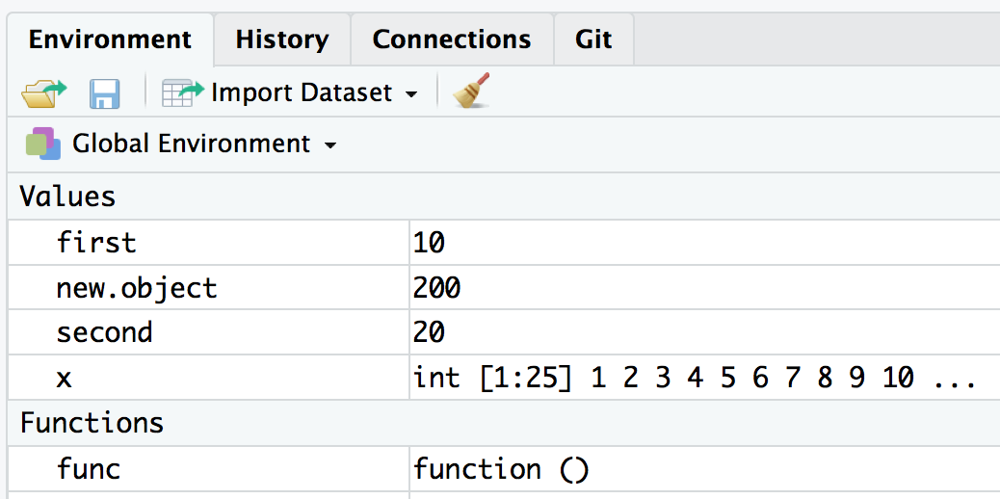

# Topics Covered*

.footnote[**This lecture has been modified from material developed by Eric Rexstad*]

- The advantages of using **functions**

--

- Different types of **environments**

--

- Understanding the **scope** of variables

--

- Software **design** for statisticians

--

- Coding **conventions and style**

---
class: inverse, center, middle

# Functions

---

# Why use functions?

1. Don't Repeat Yourself

  - Avoid repeating the same code over and over
  
--

2. Functions Do One Thing
  - Small chunks with defined inputs and outputs are easier to test 

--

3. Easier to update and propagate changes 
  - Only have to change things once

--

4. Make code more organized and readable
  - Each function is a step of the analysis
--


---

# What happens in `f(x)` stays in `f(x)`

--

.center[]

--

- Concept of **encapsulation**
    - send everything into function as arguments
    - return outputs explicitly with `return()` function
    - no global side effects 🚫🌏

    
---

# What happens in `f(x)` stays in `f(x)`

--

.pull-left[

```{r comment='#'}

x <- 1:25

func <- function(){
  sum(x)/length(x)
  }

func()

```

]

--

.pull-right[

```{r comment='#'}

# my.mean calculates the mean 
# of a numeric vector x

my.mean <- function(x){
  stopifnot(is.numeric(x))
  m <- sum(x)/length(x)
  return(m)
  }

x <- 1:25
my.mean(x)

```

]

- **Q:** What are three things that make the example on the right better?

---
# What happens in `f(x)` stays in `f(x)`

- Example from last class:

```{r}
eda <- function (x) {
  par(mfrow = c(1 ,3))
  hist(x, probability = TRUE)
  lines(density(x))
  boxplot(x, horizontal = TRUE)
  rug(x)
  qqnorm(x)
  return(summary(x))
}
```

- Issues: no comments and global change in par()

---

# What happens in `f(x)` stays in `f(x)`

```{r}
eda <- function (x) {
  # Function to generate descriptive plots of
  # a numeric vector x
  p <- par(no.readonly = TRUE) # save existing graphical params
  par(mfrow = c(1 ,3)) # setup 1x3 graphical device
  hist(x, probability = TRUE) # plot 1
  lines(density(x)) # add density
  boxplot(x, horizontal = TRUE) # plot 2
  rug(x) # add rug to boxplot
  qqnorm(x) # plot 3
  par(p) # reset graphical params
  return(summary(x)) # return summary stats
} # end eda


```
---
# What happens in `f(x)` stays in `f(x)`

```{r}

print.and.multiply <- function(x, y) {
   print(paste('At start of function x=', x, 'y=', y))
   x <- x*y 
   print(paste('At end of function x=', x))
   return(x)
}

first <- 10
second <- 20
new.object <- print.and.multiply(first, second)
```
--
- **Q:** After running the above code, what is the value of `first`?  Of `x`?

---

class: inverse, center, middle

# Environments

---

# Environments are like address books

- An **environment** associates names with values

.pull-left[
]

--

.pull-right[
]  

- Multiple names can point to the same values

---

# What's in your environment?

```{r}
ls()
```



---

# Three types we care about

- Base environment
  
  - Contains packages like `base`, `utils`, `stats`, `graphics`

--

- Global environment
  
  - Additional variables you have created or packages you have loaded
  
  - Should "reset" every time you reopen R

--

- Current environment
  
  - Environment inside of a function 


---

class: inverse, center, middle

# Scoping

---

# Name Masking

- If a name isn't defined in the environment, `R` looks up one level 

--

```{r}

pi

```

--

```{r}

pi <- 1

pi

```

--

😱😱😱

```{r}

rm(pi)

```

---

# Functions vs. variables

- Finding functions works the same way as finding variables

--

- You *can* have both `x <- 1:10` and `x <- function(x){x + 10}` ...

--
  
  - but please don't.
  
--
  
- Multiple functions can have the same name
  - R will default to the version in the most recently loaded package
  - order of search can be seen using `search()`
---

# A fresh start

- each use of a function is independent of any previous uses

--

- a function's environment is wiped clean for each new use

---

# Dynamic lookup

- Lookup happens when code or function is executed

--

- It does not matter what the value was when the code or function was created

```{r}
x <- 15

f <- function(x){x+1}

f(x)

x <- 20

f(x)
```


---
class: inverse, center, middle

# Software Design

---

# Strategies for designing code

- Always a good idea to consider design before implementation

  - strategies include top-down (rigid) and bottom-up (iterative) approaches
  
--

- Visual aids like flowcharts can be used for planning and documentation

--

- Outlines or pseudocode are helpful for breaking a big task into maneageable bits

---
class: inverse, center, middle

# Coding Conventions

---

# Conventions and style

- Encompasses everything from file names to spacing around operators

--

- Increases readability

--

- As with the Oxford comma, people have strong opinions

--

- Consistency is most important

---

# Conventions and style

- The things we care about* in this course are:

 .footnote[*HINT: these are things we will be looking for in your assignments!]

--

  - Use `<-` for assignment, `=` for function arguments, `==` for Boolean
  
--

  - Start all functions with comments listing purpose, inputs, outputs

--

  - Use indentation and spacing to make code 2-D

--

  - There should be spaces around operators and after commas

--

  - Lines should be <80 characters long

--

  - Use meaningful variable names in a consistent style

---

# Conventions and style

- Style guides are available at
  - https://google.github.io/styleguide/Rguide.xml
  - http://style.tidyverse.org/ (inc. packages to restyle code)
  

