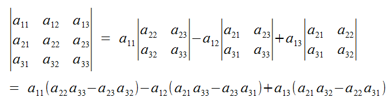

```{r, include=FALSE}
help <- TRUE
solution <- FALSE
```

```{asis, echo=solution}
<div class=soln>
SOLUTIONS
</div>
```


```{r, motivating, echo=FALSE}
student.performance <- 
      matrix(data=c(33, 27, 34, 37, 31, 22, 31, 31, 31, 27, 28, 27, 27, 
      32, 27, 32, 28, 34, 23, 30, 30, 26, 29, 33, 33, 31, 27, 32, 29, 
      35, 30, 23, 34, 33, 30, 28, 30, 27, 31, 34, 24, 30, 28, 28, 29, 
      31, 30, 27, 30, 34, 34, 29, 38, 32, 37, 32, 27, 37, 35, 31, 33, 
      33, 27, 37, 33, 30, 33, 31, 32, 36, 35, 32, 33, 33, 36), nrow=25, ncol=3)
colnames(student.performance) <- c("M1", "M2", "M3")
library(knitr)
library(kableExtra)
kable_styling(kable_input=kable(student.performance, "html"),
              full_width=FALSE, position="float_right", bootstrap_options = "condensed")
```

# Introduction

The objective of this practical is for you to get some practice (a) turning algorithms into code, and (b) writing functions in `R`.

We will focus on implementing a statistical hypothesis test for the equality of two correlation coefficients. 

## Motivating example

Student performance in a class of size 25 is predicted on the basis of their performance on two modules (M1 and M2) that serve as a prerequisite.  Performances on all three modules on a scale of 0-50 marks.  Our interest lies in determining if each prerequisite carries equivalent "explanatory" power in determining performance in the final module (M3).  There are many ways to do this, but here we will calculate the correlation between M1 and M3 and between M2 and M3, and then perform a statistical test to see if we can reject the null hypothesis that these two correlation coefficients are the same.

Can you guess from visual inspection of the values given on the right whether strength of correlation of (M1, M3) is equivalent to strength of correlation of (M2, M3)?

# Function for testing equality of correlaton coefficients

## Statistical procedure

Methods for testing equivalence of correlation coefficients were examined in this ancient paper:

***


***

Dr. Steiger recommends a t-test, using a test statistic developed by Williams (1959), as follows.  

Assume a data generating process that generates trivariate data, $\{x_1, x_2, x_3\}$ where the correlation between variable $i$ and $j$ is denoted $\rho_{i,j}$.  We have a sample of data $X$, where $X$ is a data matrix with $n$ rows and 3 columns (corresponding to the three variables).  Let $R$ be the corresponding 3x3 correlation matrix, such that $R_{i,j}$ (i.e., the $i$th row and $j$th column of the matrix $R$) corresponds to the correlation of column $i$ of $X$ with column $j$.  We wish to test the null hypothesis $\rho_{1,3} = \rho_{2,3}$ against the alternative hypothesis $\rho_{1,3} \neq \rho_{2,3}$.  The test statistic is given by

$$T = (R_{1,3} - R_{2,3}) \sqrt{\frac{(n-1)(1+R_{1,2})}{2\frac{n-1}{n-3} |R| + \left(\frac{R_{1,3} + R_{2,3}}{2} \right)^2\left(1-R_{1,2}\right)^3}}$$

where $|R|$ is the determinant of $R$.  If the null hypothesis is true, $T$ follows a Student's t-distribution with $n-3$ degrees of freedom.

## Algorithm

Here's an algorithm summarizing the above procedure.  (Note, this isn't a very complete algorithm as you need the above information to make sense of it.)

~~~
Algorithm: pair.correlation.test (X)
  1. Calculate correlation matrix of X
  2. Calculate test statistic, T
  3. Compute p-value
  4. Return p-value
~~~

##  Over to you

* Write a function in `R` implementing the above algorithm.
* Use your function on the student performance data to test the null hypothesis that performance on M1 and M2 are equivalent in being able to predict performance on M3.

Here is some code to read in the data into a matrix `student.performance`:

```{r motivate-data}
student.performance <- 
      matrix(data=c(33, 27, 34, 37, 31, 22, 31, 31, 31, 27, 28, 27, 27, 
      32, 27, 32, 28, 34, 23, 30, 30, 26, 29, 33, 33, 31, 27, 32, 29, 
      35, 30, 23, 34, 33, 30, 28, 30, 27, 31, 34, 24, 30, 28, 28, 29, 
      31, 30, 27, 30, 34, 34, 29, 38, 32, 37, 32, 27, 37, 35, 31, 33, 
      33, 27, 37, 33, 30, 33, 31, 32, 36, 35, 32, 33, 33, 36), nrow=25, ncol=3)
```

Hints:

* The input argument (`X` in the algorithm) could either be an `R` matrix or a data frame - up to you!

* Don't worry about input checks (i.e., checking that `X` has the correct dimensions, etc) in the first instance

* The built-in `R` functions `cor` and `det` calculate correlation and determinant, respectively.

* The test statistic formula is fairly long, so you might want to separate the calculation into multiple lines - this will make the code easier to read.

* To calculate the p-value, you will need a cumulative distribution function for the t-distrbution.  You should be able to find the relevant function by extrapolating from the function names you encountered in Practical 0, part 1,  under the heading __Distributional Calculations in R__.  If you're still stuck, try typing `?distribution` into the R console.  (Or ask an instructor!)

```{asis, echo=solution}
<div class=soln>
You want the function `pt`.
</div>
```

* Note that the alternative hypothesis is specified as a _two-tailed_ test. What does that imply about the p-value to be calculated?

```{asis, echo=solution}
<div class=soln>
`2*pt(-abs(test.stat), degree.freedom)` otherwise P-values can be greater than 1.
</div>
```

```{r, echo=solution}
pair.correlation.test <- function(X) {
#Purpose: perform t-test of the null hypothesis that the correlation between columns 1 and 3 equals
#  that between columns 2 and 3.  Test comes from equation 7 of 
#  Steiger, J.H. 1980. Tests for comparing elements of a correlation matrix. Psych. Bull. 87:245-251.
#Inputs: 
#  X - a data matrix with 3 columns
#Outputs:
#  a scalar value that is the p-value of the test

  #Input tests should go here!
  
  #Calculate correlation of data matrix, sample size and determinant
  cor.mat <- cor(X)
  R.12 <- cor.mat[1, 2]
  R.13 <- cor.mat[1, 3]
  R.23 <- cor.mat[2, 3]
  n.obs <- nrow(X)
  det.R <- det(cor.mat)

  #Implement equation 7 of Steiger (1980)
  R.diff <- R.13 - R.23
  numerator <- (n.obs - 1) * (1 + R.12)
  denominator <- 2 * ((n.obs - 1) / (n.obs - 3)) * det.R +
                 ((R.13 + R.23) / 2)^2 * (1 - R.12)^3     
  t.statistic <- R.diff * sqrt(numerator / denominator)
  p.value <- 2 * pt(abs(t.statistic), n.obs - 3, lower.tail = FALSE)
  return(p.value)
}

pair.correlation.test(student.performance)
```

During the class we will discuss good programming practice related to commenting and laying out the code. 

```{asis, echo=solution}
<div class=soln>
See above code!  Note presence, amount and positioning of comments; use of blank lines to separate blocks of code; use of indenting; use of spaces within lines of code to make the numerical operations more easily readable.
</div>
```

You should test your code to make sure it works the way you think it should.  We will discuss testing in a future lecture and practical, but in the meantime, think about what tests you can perform and implement them.

##  Extending your function

* When reporting the results of a t-test, one typically reports the T value, the degrees of freedom associated with the test, and the p-value.  At the moment, your function just returns the latter.  Extend it so that it returns all three of the above.  It should return a list with three (named) elements: `statistic` (the value of the t statistic), `parameter` (the degrees of freedom), and `p.value` (the p-value).

```{r, echo=solution}
pair.correlation.test <- function(X) {
#Purpose: perform t-test of the null hypothesis that the correlation between columns 1 and 3 equals
#  that between columns 2 and 3.  Test comes from equation 7 of 
#  Steiger, J.H. 1980. Tests for comparing elements of a correlation matrix. Psych. Bull. 87:245-251.
#Inputs: 
#  X - a data matrix with 3 columns
#Outputs:
#  statistic - t-value
#  parameter - degrees of freedom
#  p.value - p-value from test

  #Input tests should go here!
  
  #Calculate correlation of data matrix, sample size, df and determinant
  cor.mat <- cor(X)
  R.12 <- cor.mat[1, 2]
  R.13 <- cor.mat[1, 3]
  R.23 <- cor.mat[2, 3]
  n.obs <- nrow(X)
  df <- n.obs - 3
  det.R <- det(cor.mat)

  #Implement equation 7 of Steiger (1980)
  R.diff <- R.13 - R.23
  numerator <- (n.obs - 1) * (1 + R.12)
  denominator <- 2 * ((n.obs - 1) / (n.obs - 3)) * det.R +
                 ((R.13 + R.23) / 2) ^ 2 * (1 - R.12)^3     
  t.statistic <- R.diff * sqrt(numerator / denominator)
  p.value <- 2 * pt(abs(t.statistic), df, lower.tail = FALSE)
  return(list(statistic = t.statistic, parameter = df, p.value = p.value))
}

pair.correlation.test(student.performance)
```

* Try adding some basic checks on the inputs

```{asis, echo=solution}
<div class=soln>
Not implemented in these solutions.
</div>
```

# Optional exercises

## Option 1: create your own determinant function

Here's how to calculate the determinant of a 3 x 3 matrix:



* Write a function to implement this - you could call it `my.det`
* Test your function by comparing its output with the built-in `det` function.
* Edit your `pair.correlation.test` function so it calls the `my.det` function, rather than the built-in function.

```{r, echo=solution}
my.det <- function(X) {
#Purpose: calculates the determinant of a 3x3 matrix
#Inputs: 
#  X - 3x3 matrix
#Outputs:
#  a scalar value that is the determinant of the matrix
#Implementation note:
#  Makes no checks on the inputs
  
  part.1 <- X[1, 1] * (X[2, 2] * X[3, 3] - X[2, 3] * X[3, 2])
  part.2 <- X[1, 2] * (X[2, 1] * X[3, 3] - X[2, 3] * X[3, 1])
  part.3 <- X[1, 3] * (X[2, 1] * X[3, 2] - X[2, 2] * X[3, 1])
  return(part.1 - part.2 + part.3)
}
```

### Hard bonus problem

More generally, given a square matrix $A$, its determinant is calculated as

$$det(A) = A[1,1] det(A_{11}) + \cdots + A[1,j](-1)^{1+j} det(A_{1j}) + \cdots + A[1,n](-1)^{1+n} det(A_{1n}),$$

where $A_{1j}$ is an $(n-1) \times (n-1)$ matrix resulting from deleting the first row and $j^{th}$ column of $A$.

* Write a recursive function to implement the above.
* Test it, and edit your `pair.correlation.test` function so it calls your new recursive function.

```{r, echo=solution}
my.det.recursive <- function(X) {
#Purpose: calculates the determinant of a square matrix, using a recursive algorithm
#Inputs: 
#  X - square matrix
#Outputs:
#  a scalar value that is the determinant of the matrix
#Implementation note:
#  Makes no checks on the inputs
  
  #Compute the number of rows
  n <- nrow(X)
  
  if (n == 1){
    #It's a 1x1 matrix, so return the value of this element
    value <- X[1, 1]
  }  else {
    #Bigger than 1x1
    value <- 0
    #Loop over all columns
    for (j in (1:n)){
      #Get the appropriate X1j
      if (j == 1){
        #First column
        X1j <- matrix(X[2:n, 2:n], n - 1, n - 1)
      } else {
        if (j == n){
          #Last column
          X1j <- matrix(X[2:n, 1:(n - 1)], n - 1, n - 1)
        } else {
          #All other columns
          X1j <- cbind(X[2:n, 1:(j - 1)], X[2:n, (j + 1):n])
        }
      }
      #Recursive call
      value1 <- my.det.recursive(X1j)
      value2 <- X[1, j] * (-1) ^ (1 + j)
      value <- value + value1*value2
    }
  }
  return(value)
}
```


## Option 2: use simulated data to examine performance of test

Simulation study is an excellent way to investigate the performance of a statistical procedure.  We'll be doing quite a bit of this during the module, so if you have extra time in this practical you could make a start with the t-test we have just programmed.

Below is an function to generate trivariate correlated data from a multivariate normal distribution.  Have a look at them and make sure you understand what they are doing.  Then you can start using the function.  Start by generating a few datasets and passing each one into you `pair.correlation.test` function.  See how the p-value varies with varying true differences between $\rho_{1,3}$ and $\rho_{2,3}$.  Of course, since the data generated is (pseudo-)random, you won't get the same answer each time you run the routine.

To get a more reliable picture of how the test performs for a given value of $\rho_{1,3}$ and $\rho_{2,3}$, you could write code to repeat the data generation and testing procedure many times (1,000, say).  Instead of recording the p-value each time, you could record whether the p-value is less than some specified significance level, conventionally $\alpha=0.05$.  The proportion of times $p < \alpha$ is an estimate of the statistical power of the test.  You could use your code to determine how power variates as the difference between $\rho_{1,3}$ and $\rho_{2,3}$ increases for a given sample size, or how power varies for a fixed difference between $\rho_{1,3}$ and $\rho_{2,3}$ but with increasing sample size.

```{r, echo=help}
rnorm.trivariate <- function(n, mean, sd, rho) {
# Purpose: generate matrix of trivarate normal data, with specified mean, sd and correlations
# Inputs:
#   n - number of samples
#   mean - vector of menas (length 3)
#   sd - vector of standard deviations (length 3)
#   rho - vector of correlations (length 3).  First is correlation between 1st and 2nd variate, second is
#     correlation between 1st and 3rd variate, third is correlation between 2nd and 3rd variate.
# Outputs:
#   matrix with n rows and 3 columns of trivariate normal data
# Implementation notes:
#   Loads the MASS library
#   No checks on inputs!
  
  #Load MASS library so we can access mvrnorm function
  library(MASS)
      
  #mvrnorm requires a covariance matrix so assemble one from sd and rho inputs
  covar.mat <- matrix(NA, 3, 3)
  covar.mat[1, 2] <- rho[1] * sd[1] * sd[2]
  covar.mat[1, 3] <- rho[2] * sd[1] * sd[3]
  covar.mat[2, 3] <- rho[3] * sd[2] * sd[3]
  #Note - there are more elegant ways to copy the upper triangle to the lower triangle!
  covar.mat[2, 1] <- covar.mat[1, 2]
  covar.mat[3, 1] <- covar.mat[1, 3]
  covar.mat[3, 2] <- covar.mat[2, 3]
  diag(covar.mat) <- sd^2

  #Call mvrnorm and return
  dat <- mvrnorm(n, mu = mean, Sigma = covar.mat)
  return(dat)
}
```


# References

* Steiger, J.H. 1980. Tests for comparing elements of a correlation matrix. Psychological Bulletin 87:245-251.
* Williams, E.J. 1959. The comparison of regression variables. Journal of the Royal Statistical Society (B) 21:396-399.
