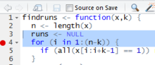
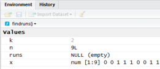
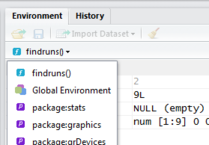
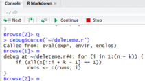

```{r, include=FALSE}
help <- TRUE
solution <- FALSE
```

```{asis, echo=solution}
<div class=soln>
**SOLUTIONS**
</div>
```

# How do you know your code works?

- Writing code is only the first step
- As a programmer, you need to determine if your code performs as you intended

## Types of code errors

- syntax errors
    - code not consistent with the programming language
    - not always obvious in `R`

```{r}
bad <- function(x = 7) {
  if (x > 10) {
    y <- ln(22)
  } else {
    y <- 7
  }
  return(y)
}

this.x <- 4
answer <- bad(this.x)
print(answer)
```

- logic errors
    - topic of today's practical
- numerical errors (overflows/underflows/floating point problems)
    - limitation of manner numbers are stored in computers
    - topic of next Wednesday's lecture
  
# Code testing

## How to build tests

- do you know what your code should produce?
    - result from a textbook or paper
    - result in a more simple case
    - result from previous version of your code
- how does code behave with special cases?
    - input is 0
    - input is NA
    - input is gigantic, gigantically negative
- build the tests prior to building the code (?!)
    - code is created so as to pass the tests
    
# Code does not work, where is the error?

- Using modular programming, you have created code as a series of functions
- Process of finding error summarised as:

> "... confirming, one by one, many things you _believe_ to be true about your code, actually _are_ true.  When you find a belief that is _not_ true, you have found a clue to the location of a bug."  -- Norman Matloff

- examine results of each function, when result does not conform to expectation, performance of that function is in doubt.

## A function to debug

Here is a small bit of code, from [Matloff (2011, Chapter 13)](http://library.st-andrews.ac.uk/search~S5?/amatloff&keyword-selector=author/amatloff/1%2C4%2C7%2CB/frameset&FF=amatloff+norman+s+author&1%2C1%2C).  The purpose of the function `findruns` is to examine vectors containing binary values (0,1), and locate runs of consecutive `1s` of given length.

The algorithm:

- Start at beginning of the vector 
- move sequentially in blocks of length _k_
- test whether all elements within the block are 1's
    - if yes, denote first element of block as beginning point of a 'run'
    - if no, slide window along to next block
- terminate when last element of block corresponds to last element in vector

Example run:

```{r, echo=FALSE}
findruns.correct <- function(x, k) {
  n <- length(x)
  runs <- NULL
  for (i in 1:(n - k + 1)) {
    if (all(x[i:(i + k - 1)] == 1)) runs <- c(runs, i)
  }
  return(runs)
}
```

```{r}
test.case <- c(1, 0, 0, 1, 1, 1, 0, 1, 1)
findruns.correct(test.case, 2)
```
indicating runs of length 2 begin in positions 4, 5, and 8.

Imagine however, you have been presented with code shown here:

```{r, echo=TRUE}
findruns <- function(x, k) {
  n <- length(x)
  runs <- NULL
  for (i in 1:(n - k)) {
    if (all(x[i:i + k - 1] == 1)) runs <- c(runs, i)
  }
  return(runs)
}
```
when this code is presented with the test case from above:
```{r}
findruns(test.case, 2)
```
Erroneous results are discovered.  Two of the locations are detected correctly, but another run is erroneously reported, and the final run is mis-located.

# Your task

Diagnose and correct the problems within these eight lines of code.

## Classic debugging strategies

- Trial and error: maybe you can guess what is wrong based on the output

- Make your function global: set global values for the arguments and step through the function

- Add `print()` statements: use to print object values as the function progresses

- More information about debugging in general: [Advanced R: Exceptions and Debugging](http://adv-r.had.co.nz/Exceptions-Debugging.html)

## RStudio debugger

An extensive _how to_ description of using the R Studio interactive debugger is at the [R Studio support website](https://support.rstudio.com/hc/en-us/articles/205612627-Debugging-with-RStudio).  

R Studio have also produced [a 10-minute video describing the use of their debugger.](https://vimeo.com/99375765)  Please use headphones if you choose to watch this in class!

Using the debugger consists of pausing execution of your code.  This is done in one of several ways 

- breakpoints - places in your code where you wish execution to pause.  These can be set using
    - editor window and mouse (click to left of line number) 
    - insert `browser()` call in code
- if suspicious line of code is not known, use menu command: `Debug | On Error | Break in Code`

## The environment pane

When the debugger is invoked, the environment pane shows the state of the current environment.  Above the Values in the environment pane, is a pull-down menu showing the sequence of environments that will be searched to find object values.



We discussed this `search chain` in Lecture 3 in the context of searching through loaded packages to find a function.

Not only are objects in the current environment that have been assigned a value displayed, but also values of arguments that have been passed into the function _but not yet evaluated_ (called "promises") are also show in grey (the argument `k` in this case).



## Code and console panes

When debugging, the code pane highlights the location as code is executed.  That way flow of control is apparent to you as you step thorough your code.  

How to step through your code you might ask.  Note the console pane has been changed when the debugger is operating.



Stepping through lines of code is done using either `next` for a single line, `run to end` of function or loop or `continue` until next breakpoint is encountered.  As the code is processed, you can see resulting changes to the values in the environment.  You can also change the values of objects in the environment by typing assignment operators after the `Browse[2]>` prompt.

By the way the `[2]` indicates the depth to which the code you are executing is nested within R's environment.  `[1]` indicates code is in the `Global Environment`, `[2]` is inside a function called from the Global Environment, `[3]` would be inside a function called from a function called from the Global Environment.

With your new friend, the debugger, set about your task of 

-  finding the error(s) within the function `findruns()`
-  correct those errors so the function performs as expected


***

```{asis, echo=solution}
<div class=soln>
# Solution

There are actually two errors in the code provided.

- Parenthesis missing from the line inside the `for` loop.  
    - The expression `i:i + k - 1` is screwy because `i:i` will be executed before the `i + k - 1`.  To rectify this, protect `(i + k - 1)` with parentheses so it is computed first.
- the condition of the `for` loop itself is incorrect
    - the last pass through the loop is performed prematurely, the final pass through the loop should occur when `i = n - k + 1` or 8 in the case of our 9-element vector seeking series of length 2.
</div>
```

***

# Extra practice in constructing random deviates (if you wish)

Remember the family of `d`, `p`, `q`, `r` functions for statistical distributions?  They produce the probability density function, cumulative distribution function, inverse cumulative distribution function and random deviates respectively.  These functions are provided in R for a number of statistical distributions: normal, Students t, $\chi^2$, F, ...  But one (of many) distributions that do not have these functions is the Pareto (named after an Italian scientist).  It is a two-parameter distribution that has found uses in modelling the upper tail of wealth distribution. 

Create PDF $f(x)$, CDF $F(x)$ and inverse CDF $F^{-1}(p)$ functions based upon this equations:

$$
f(x;\alpha, x_0) =  \left\{
                \begin{aligned}
                  \frac{\alpha-1}{x_0}\left( \frac{x}{x_0} \right)^{-\alpha}, & x \ge x_0\\
                  0, & x \lt x_0
                \end{aligned}
              \right.
$$
$$
F(x; \alpha, x_0) = 1 - \left( \frac{x}{x_0}\right)^{-\alpha + 1}
$$

$$
F^{-1}(p; \alpha, x_0) = x_0 \left (1-p \right )^{-\frac{1}{\alpha-1}}
$$

Having written those functions, the remaining function would be `rpareto()` to generate deviates distributed as Pareto.  However, there is no formula to produce these deviates. Consequently, we resort to using a method of producing random deviates called _quantile transform_ method or _inverse transform sampling_.

Here is a one-sentence description of the _quantile transform_.  Given the y-range of $F(x; \alpha, x_0)$ is [0,1], by generating random deviates $\sim U(0,1)$ and passing them as arguments to $F^{-1}(p; \alpha, x_0)$.  With that hint, complete the fourth function `rpareto()` for this distribution.

For example, this figure depicts producing a value from $\sim U(0,1)$ (0.6 in this case) and projecting that value from the y-axis, through the CDF, onto the x-axis to produce a random deviate from the Pareto distribution with parameters $\alpha=1.3$ and $x_0=1$, resulting in a Pareto-distributed deviate value of 32.

```{r, invcdf, echo=FALSE, fig.height=3}
ppareto <- function(x, alpha, x0) {
  result <- 1 - (x / x0) ^ (-alpha + 1)
  return(result)
}
qpareto <- function(p, alpha, x0) {
  result <- x0 * (1 - p) ^ (-1 / (alpha - 1))
  return(result)
}
mys <- seq(1, 500, length = 100)
plot(mys, ppareto(mys, 1.3, 1), type='l', lwd=2,
     ylab = "CDF(pareto)", xlab = "Deviate")
my.rand <- 0.6
curve.touch <- qpareto(my.rand, 1.3, 1)
arrows(-100, my.rand, curve.touch, my.rand, lty = 3, length = 0.1)
arrows(curve.touch, my.rand, curve.touch, 0, lty = 3, length = 0.1)
text(32, 0, "32", col="red")
```

```{r, echo=solution}
dpareto <- function(x, alpha, x0) {
  t1 <- (alpha - 1) / x0
  t2 <- (x / x0) ^ -alpha
  result <- t1 * t2
  return(result)
}

ppareto <- function(x, alpha, x0) {
  result <- 1 - (x / x0) ^ (-alpha + 1)
  return(result)
}

qpareto <- function(p, alpha, x0) {
  result <- x0 * (1 - p) ^ (-1 / (alpha - 1))
  return(result)
}

rpareto <- function(n, alpha, x0) {
  x <- vector(length = n)
  result <- qpareto(p = runif(n), alpha, x0)
}
```

## Extra extra practice

What checks should be placed upon the arguments coming into each of these functions?
