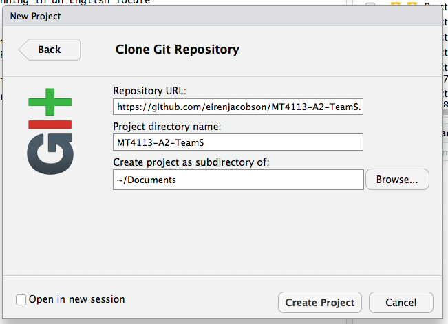

```{r, include=FALSE}
help <- TRUE
solution <- FALSE
library(knitr)
library(kableExtra)
options(knitr.table.format = "html") 
```


# Collaborative programming

This practical asks you to work in the teams you will use for the second assignment.  The coding objective is fairly easy

> Alter five files/functions to assess mean square error performance of trimmed means for data sampled from a mixture distribution.

Nearly all the code is already written, your teams merely need to scan through the files and provide the missing code components.

The five functions and their purposes:

* `do.sim.r()`
    * runs the simulations by creating replicate datasets of the mixture distribution, computing the trimmed means, expected value of the distribution and mean square error
* `mix.dist.r()`
    * generates data from mixture distribution
* `get.expectation()`
    * calculates expected value of distribution with specified parameters
* `estimate.mean()`
    * calculate trimmed means (these are estimates of the expected value)
* `mean.square.error()`
    * compute the mean square error for each of the trim levels

# Accessing your team repository

Before altering the files, you will need to access them.  This involves working with the collaborative programming environment provided by **Github**; a cloud service.  Having acquired access to the cloud service, you will need software to shift files from your own computer (or Microlab computers) to the cloud, checking for possible collisions of edited files.  Uploading/downloading/synchronising of files is done with software called **Git**.

Consequently, today's practical has the additional purpose of introducing you to Github and Git so you can perform the practical objective, and acquaint you with these tools to be used in your second assignment.

I have created a Github **repository** or (repo) for each team that should serve as a skeleton for how you organize your work for Assignment 2.  You will clone the team repository to your local hard drive, from where you can edit the files. Once you have made changes, you will *stage* and *commit* files, then *push* the edited files to the team repository.  All team members can then *pull* the changes you made into their local copies of the repository.  When all the editing is completed, the files can be bundled into a *release* for distribution to others.

First, visit the [github.com](http://github.com) website and sign up for an account, selecting a user name of your choice and your email address.

Once you have a GitHub account, find an instructor and we will add you to your team's repository.

# Explore the team repository

Have a look around your team's repo. Notice that the README file is the landing page for your repository and is a [Github-flavored Markdown](https://guides.github.com/features/mastering-markdown/) document.  This is where you will write your project report.  Practice collaborating on this document by having each team member edit the README file to contain their name and student ID #. 

On the upper right hand corner of the README, there is a symbol that looks like a pencil.  Click this to edit the file.


Then, scroll down and commit your change.


# Clone team repo onto your local computer

Because you will be editing the files in the team repo, best to have a local copy to do your editing. Clone the team repo onto your local computer with these steps:

First, copy the link using the clipboard icon at the far right.


In RStudio, navigate to File > New Project > Version Control > Git.  Tell RStudio where to put the repository and what it should be called.



This will have cloned the repository to your local hard drive.  Examine the content of this folder that contains all the files that were in the Github repository you successfully cloned.

# Practice adding files to your repository

On Moodle, in the folder for Practical 3 there is a folder of six R functions.  Decide which team members will be in charge of which functions, and download accordingly into the Scripts folder of your team repository.  E.g., Eiren might download `estimate.mean.r` and save it to `Desktop\MT4113-A2-TeamS\Scripts` on her computer, and Len might download `do.sim.r` and save it to `Documents\MT4113-A2-TeamS\Scripts` on his computer.

Now, navigate to the Git pane in the upper right corner of your RStudio session


You should see the file that you just added. It hasn't been added to the repository yet, hence the `?`.  Tick the box to the left of the file name and click Commit.  Add a message describing the change that you made to the repository.


Now, click Push in the Git pane within RStudio.


Note: if you are comfortable with command line, these actions can be done in the Terminal pane of RStudio.  See Eiren for a command-line cheatsheet if you are interested.

When everyone on your team has pushed their files to the remote repository, look at the GitHub page for your team.  Under commits, you should see a list of who added what files.


Now, each team member should click pull within RStudio.  This will update the local version of your repository to match what is on the GitHub page.

Get into the habit of beginning any editing session of a team project with `pull`.  Failure to start your editing session with a `pull` will likely lead to conflicts.

# Practice editing files 

With RStudio, open one of the function files.  Make a small edit, perhaps add a comment line.  Save the file.  Now, go back to the Git pane in RStudio, stage the file, commit the change, and push to the remote repository, like you did above. 

# Carry out the task described

Edit the function files as necessary to perform the programming task, which should help you get started with Assignment Task 4.  Pay particular attention to seeing how edits of team members propogate up to the team repo, and are then pulled down to your local repo.

# Disaster recovery


